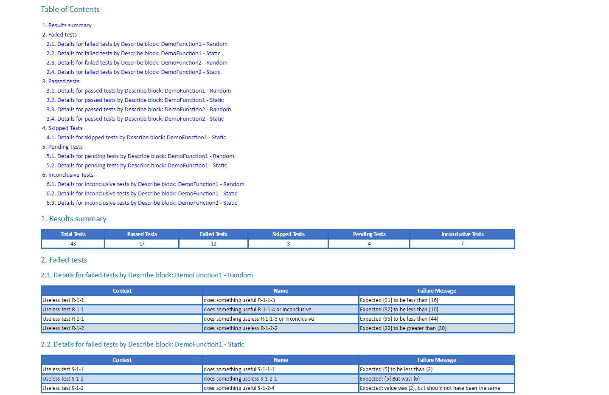

[](https://ci.appveyor.com/project/equelin/format-pester/branch/master)

# Format-Pester

Powershell module for documenting Pester's results.

All the formating work is done by the module [PScribo](https://github.com/iainbrighton/PScribo).

Reports are generated base on a custom PowerShell object returned by Invoke-Pester run with the parameter `PassThru`. NUnit style files generated by Pester are not supported at that moment by Format-Pester.

If you can't generate report on a computer where tests are executed please save tests results piping them to `Export-Clixml`.

You can be interested also in the [ReportUnit](https://github.com/reportunit/reportunit) tool what is a report generator for the test-runner family. It uses stock reports from NUnit, MsTest, xUnit, TestNG and Gallio and converts them HTML reports with dashboards.

## Report example



Partial screenshot for a HTML report generated by Format-Pester v. 1.5.0, PScribo v. 0.7.15.63, [the full screenshot](./img/Format-Pester-1.5.0-full.png).

More examples you can find [here](/examples/).

## Supported languages

Since version 1.3.0 internationalization of generated reports is supported. Internalization means that report parts e.g. section names, columns headers, etc. can be wrote in a language different than English.

Currently available languages

- en-US - English United Staes - main language
- pl-PL - Polish

If would you like add support for your language please read the section [Information for translators](https://github.com/equelin/Format-Pester/wiki/Information-for-translators) in the project wiki.

# Requirements

- Powershell v.4.x
- [Pester](https://github.com/pester/Pester)
- [PScribo](https://github.com/iainbrighton/PScribo)

# Usage

Format-Pester is the PowerShell module so before usage it you need import it - more instruction you can find in [wiki](https://github.com/equelin/Format-Pester/wiki/Importing-Format-Pester).

## Example 1

```PowerShell
  Invoke-Pester -PassThru | Format-Pester -Path . -Format HTML,Word,Text
```

This command will document the results of the Pester's tests. Documents will be store in the current path and they will be available in 3 formats (.html,.docx and .txt).

## Example

```PowerShell
    Invoke-Pester -PassThru | Export-Clixml -Path .\Test-Result.xml

    Import-Clixml -Path .\Test-Result.xml | Format-Pester -Format .\ -BaseFileName Test-Result -Format HTML -FailedOnly
```

The first command you can run e.g. on a server where PScribo and Format-Pester is not installed. The tests results will be stored in a file as xml representation of object.

After copy the file to the computer where PScribo and Format-Pester are available you can generate report. The html file will be generated with results of failed tests only.

## Online help

You can read [online version of help](/doc/Format-Pester.md) - online help generated by [platyPS module](https://github.com/powershell/platyps).

# Initial author

- Erwan Quélin - [GitHub](https://github.com/equelin) - [Twitter](https://twitter.com/erwanquelin)

# Contributors

- Travis Plunk - [GitHub](https://github.com/TravisEz13) - [Twitter](https://twitter.com/TravisPlunk)
- Wojciech Sciesinski - [GitHub](https://github.com/it-praktyk) - [Twitter](https://twitter.com/ITpraktyk)


# [Version history](VERSIONS.md)

# [TODO and development plans](TODO.md)

# License
Copyright 2016 Erwan Quelin and the community.  
Licensed under [the MIT License](LICENSE)
