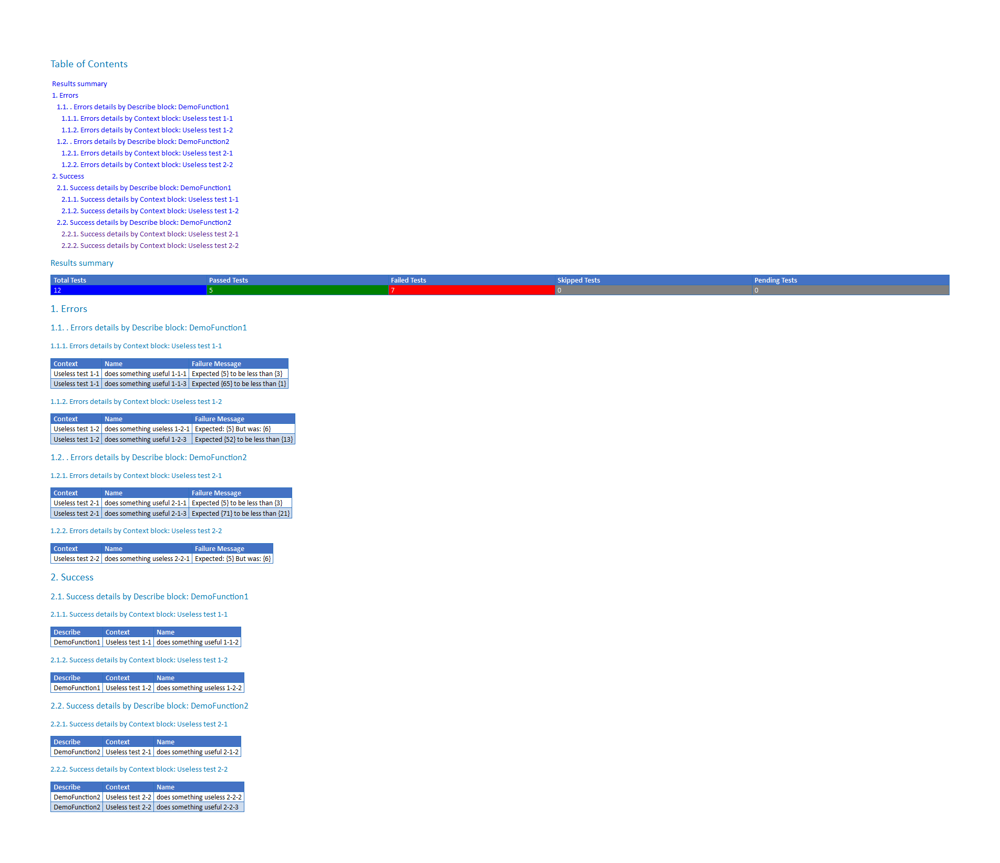

[](https://ci.appveyor.com/project/equelin/format-pester/branch/master)

# Format-Pester
Powershell module for documenting Pester's results.



All the formating work is done by the module PScribo.

# Requirements

- Powershell
- [Pester](https://github.com/pester/Pester)
- [PScribo](https://github.com/iainbrighton/PScribo)

# Instructions
### Install the module
```powershell
# One time setup with Powershell 5
    Install-Module Format-Pester

# Or Manually
    # Download the repository
    # Unblock the zip
    # Extract the Format-Pester folder to a module path (e.g. $env:USERPROFILE\Documents\WindowsPowerShell\Modules\)

# Import the module
    Import-Module Format-Pester   #Alternatively, Import-Module \\Path\To\Format-Pester

# Get commands in the module
    Get-Command -Module Format-Pester

# Help for commands
    Get-Help Format-Pester -Full
```
### Online help
You can read [online version of help](.\doc\Format-Pester.md) - online help generated by [platyPS module](https://github.com/powershell/platyps)

# Usage

```PowerShell
  Invoke-Pester -PassThru | Format-Pester -Path . -Format HTML,Word,Text
```

This command will document the results of the Pester's tests. Documents will be store in the current path and they will be available in 3 formats (.html,.docx and .txt).

# Available functions

- Format-Pester

# Contributors

- Travis Plunk - [GitHub](https://github.com/TravisEz13) - [Twitter](https://twitter.com/TravisPlunk)
- Wojciech Sciesinski - [GitHub](https://github.com/it-praktyk) - [Twitter](https://twitter.com/ITpraktyk)

# Author

**Erwan Quélin**
- <https://github.com/equelin>
- <https://twitter.com/erwanquelin>

## Information for translators
Format-Pester can be used to prepared reports in languages different than English.
To translate required strings to your language
- read information
 ```
 Get-Help about_Script_Internationalization
 ```
 online version about_Script_Internationalization available [here](https://technet.microsoft.com/en-us/library/hh847854.aspx).
- create subfolder with your language/culture code under Public - e.g. xx-XX
- copy the file Format-Pester.psd1 from Public\en-US\ to your xx-XX
- translate requred strings
- test
- use the Language parameter if your PSCulture is different than required language for output   
- submit to public repo, pull request are welcomed

# License
Copyright 2016 Erwan Quelin and the community  .
Licensed under the MIT License
