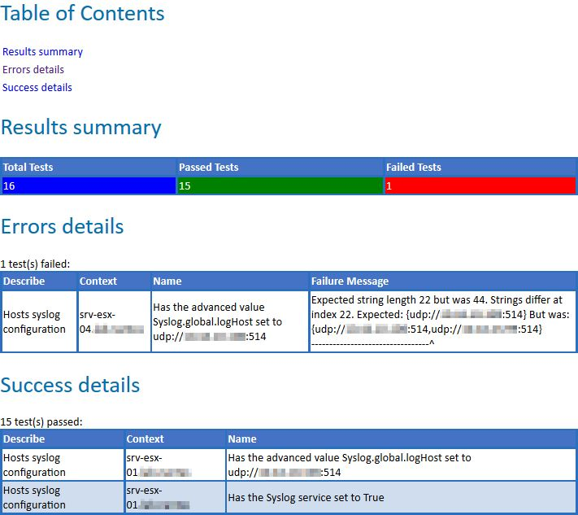

[](https://ci.appveyor.com/project/equelin/format-pester/branch/master)

# Format-Pester
Powershell module for documenting Pester's results.



All the formating work is done by the module PScribo.

# Requirements

- Powershell
- [Pester](https://github.com/pester/Pester) 
- [PScribo](https://github.com/iainbrighton/PScribo)

# Instructions
### Install the module
```powershell
# One time setup with Powershell 5
    Install-Module Format-Pester

# Or Manually
    # Download the repository
    # Unblock the zip
    # Extract the Unity-Powershell folder to a module path (e.g. $env:USERPROFILE\Documents\WindowsPowerShell\Modules\)
        
# Import the module
    Import-Module Format-Pester    #Alternatively, Import-Module \\Path\To\Format-Pester

# Get commands in the module
    Get-Command -Module Format-Pester

# Get help
    Get-Help Format-PesterResult -Full
    Get-Help Format-Pester
```

# Usage

```PowerShell
  Invoke-Pester -PassThru | Format-Pester -Path . -Format HTML,Word,Text
```

This command will document the results of the pester's tests. Documents will be store in the current path and they will be available in 3 formats (.html,.docx and .txt).

# Available functions

- Format-Pester

# Author

**Erwan Quélin**
- <https://github.com/equelin>
- <https://twitter.com/erwanquelin>

# License

Copyright 2016 Erwan Quelin.

Licensed under the MIT License